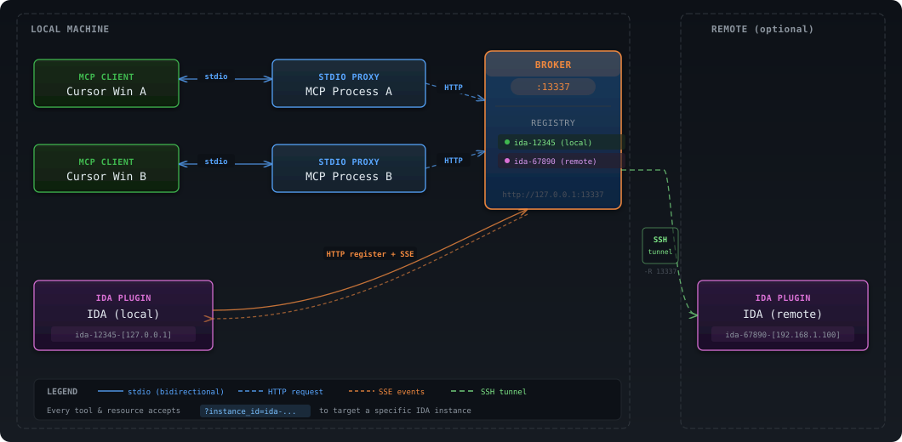

# IDA Pro MCP

<div align="center">

Simple [MCP Server](https://modelcontextprotocol.io/introduction) to allow vibe reversing in IDA Pro.

https://github.com/user-attachments/assets/6ebeaa92-a9db-43fa-b756-eececce2aca0

The binaries and prompt for the video are available in the [mcp-reversing-dataset](https://github.com/mrexodia/mcp-reversing-dataset) repository.

</div>

---

## Fork Enhancements

This fork ([fjh658/ida-pro-mcp](https://github.com/fjh658/ida-pro-mcp)) adds the following features on top of [upstream](https://github.com/mrexodia/ida-pro-mcp):

### Broker Architecture (Multi-Instance)

Central HTTP broker that enables **multiple IDA instances** to connect simultaneously. The broker is auto-started by the MCP process — no manual setup needed.

- **Broker mode** (`--broker`): Central registry on `127.0.0.1:13337`, manages IDA connections via HTTP+SSE
- **MCP mode** (default): Stdio-only client, routes requests to broker via HTTP
- **Instance routing**: Target specific IDA instances with `instance_id` parameter on any tool call
- **Auto-reconnect**: IDA plugin reconnects automatically with exponential backoff if broker restarts
- **Web config**: `/config.html` for CORS policy and per-tool enable/disable

### Enhanced Debugger API

Comprehensive multi-threaded debugger support beyond upstream's basic debugger tools:

| Tool                                       | Description                                                                |
| ------------------------------------------ | -------------------------------------------------------------------------- |
| `dbg_regs_all`                             | All registers for all threads                                              |
| `dbg_gpregs` / `dbg_gpregs_remote`         | General-purpose registers only (architecture-aware: x86/x64, ARM32, ARM64) |
| `dbg_regs_named` / `dbg_regs_named_remote` | Specific registers by name                                                 |
| `dbg_regs_remote`                          | All registers for specific thread(s)                                       |

### Microcode Analysis

- `get_microcode(addr, maturity)`: Access Hex-Rays microcode at 8 optimization maturity levels (`generated` through `lvars`), useful for understanding compiler optimizations and analyzing obfuscated code

### Large Output Handling

- **LRU output cache**: Thread-safe `OrderedDict`-based cache (max 100 entries) for large results
- **Auto-truncation**: Outputs exceeding 50KB are truncated to a 10-item preview with metadata
- **Download URL**: Full output available via `curl -o output.json http://127.0.0.1:13337/output/{instance_id}/{output_id}.json`

### Thread Safety Hardening

- `rpc.py`: `_output_cache_lock` protects all cache operations
- `api_instances.py`: `_state_lock` protects all mutable global state; `_connect_lock` serializes connections
- `http_server.py`: POST body size limit (50MB) prevents OOM; IPv6 `[::1]` localhost support
- Timer exception safety in reconnect scheduling

### Reverse Engineering Skills

Professional analysis guidance in `skills/` directory:

- **IDAPython skill**: Module router, API patterns, decompilation, type recovery
- **Reverse engineering skill**: Structured workflow (target gathering -> key functions -> deep analysis -> documentation)
- **Computed-branch deobfuscation**: Auto-resolves `JUMPOUT(...)` via microcode patching
- **Swift metadata recovery**: Fixes Swift string xref gaps

### Remote IDA Support

Run IDA on a remote machine while your MCP client runs locally — connected via SSH reverse tunnel. No Python/uv environment needed on remote, just copy the plugin files. See [Remote Setup Guide](docs/remote-setup.md) for details.

### Additional Analysis Tools

- `analyze_funcs(addrs)`: One-call comprehensive analysis — decompilation, assembly, xrefs, callees, callers, strings, constants, basic blocks
- `find_insns(sequences)`: Find instruction sequences in code (e.g. find all `MOV X0, X1; BL _objc_msgSend` patterns)

### Other Additions

- **IDA 8.3+ compatibility**: Adapter layer for frame/type APIs across IDA 8.3/8.4/8.5/9.0+
- **Extension groups**: `@ext("dbg")` decorator + `--unsafe` flag for granular tool visibility
- **Batch APIs**: `rename`, `patch`, `put_int` for bulk operations
- **Unit tests**: Test framework with IDA stub import hook (`tests/_ida_stubs.py`), 30+ tests covering cache, state management, and concurrency

---

## Prerequisites

- [Python](https://www.python.org/downloads/) (**3.11 or higher**)
  - Use `idapyswitch` to switch to the newest Python version
- [IDA Pro](https://hex-rays.com/ida-pro) (8.3 or higher, 9 recommended), **IDA Free is not supported**
- Supported MCP Client (pick one you like)
  - [Amazon Q Developer CLI](https://aws.amazon.com/q/developer/)
  - [Augment Code](https://www.augmentcode.com/)
  - [Claude](https://claude.ai/download)
  - [Claude Code](https://www.anthropic.com/code)
  - [Cline](https://cline.bot)
  - [Codex](https://github.com/openai/codex)
  - [Copilot CLI](https://docs.github.com/en/copilot)
  - [Crush](https://github.com/charmbracelet/crush)
  - [Cursor](https://cursor.com)
  - [Gemini CLI](https://google-gemini.github.io/gemini-cli/)
  - [Kilo Code](https://www.kilocode.com/)
  - [Kiro](https://kiro.dev/)
  - [LM Studio](https://lmstudio.ai/)
  - [Opencode](https://opencode.ai/)
  - [Qodo Gen](https://www.qodo.ai/)
  - [Qwen Coder](https://qwenlm.github.io/qwen-code-docs/)
  - [Roo Code](https://roocode.com)
  - [Trae](https://trae.ai/)
  - [VS Code](https://code.visualstudio.com/)
  - [VS Code Insiders](https://code.visualstudio.com/insiders)
  - [Warp](https://www.warp.dev/)
  - [Windsurf](https://windsurf.com)
  - [Zed](https://zed.dev/)
  - [Other MCP Clients](https://modelcontextprotocol.io/clients#example-clients): Run `ida-pro-mcp --config` to get the JSON config for your client.

## Installation

Install the latest version of the IDA Pro MCP package:

```sh
pip uninstall ida-pro-mcp
pip install https://github.com/fjh658/ida-pro-mcp/archive/refs/heads/main.zip
```

Configure the MCP servers and install the IDA Plugin:

```
ida-pro-mcp --install
```

**Important**: Make sure you completely restart IDA and your MCP client for the installation to take effect. Some clients (like Claude) run in the background and need to be quit from the tray icon.

https://github.com/user-attachments/assets/65ed3373-a187-4dd5-a807-425dca1d8ee9

_Note_: You need to load a binary in IDA before the plugin menu will show up.

## Usage (Broker Mode)

The entire workflow is **fully automatic** — no manual broker management needed:

1. **MCP client starts the MCP process** — When Cursor/Claude Code/etc. launches, it runs the MCP server via the configured command (e.g. `python3 server.py`). The MCP process detects no Broker on `127.0.0.1:13337` and **auto-forks one** in the background.
2. **IDA plugin auto-connects** — Open IDA, load a binary, press Ctrl+Alt+M. The plugin connects to `127.0.0.1:13337` automatically with exponential backoff retry, so startup order doesn't matter.

Typical MCP client configuration (e.g. in Claude Code `settings.json`):

```json
{
  "mcpServers": {
    "ida-pro-mcp": {
      "command": "python3",
      "args": ["path/to/server.py", "--unsafe"]
    }
  }
}
```

The MCP process launched by this config will auto-start the Broker if it's not already running. Multiple MCP clients can share the same Broker — each gets its own stdio MCP process, all routing through the single Broker instance.

To start the Broker manually (e.g. on a custom port):

```bash
uv run ida-pro-mcp --broker
# Or specify port: uv run ida-pro-mcp --broker --port 13337
```

### Architecture

- **Broker**: Listener on `127.0.0.1:13337`, holds IDA instance registry; both IDA and MCP clients connect to it. Auto-started by the first MCP process if not already running.
- **MCP Process**: Started by Cursor per window (stdio), **does not bind port**, requests Broker via HTTP.
- **IDA Plugin**: Connects to `127.0.0.1:13337` (Broker). Supports SSH reverse tunnel for remote IDA — see [Remote Setup Guide](docs/remote-setup.md).



### Web Dashboard

Open `http://127.0.0.1:13337/` in a browser to access the Broker dashboard — view all connected IDA instances, their binary paths, architecture info, and connection status in real-time (auto-refresh 10s). Server configuration (CORS policy, per-tool enable/disable) is available at `http://127.0.0.1:13337/config.html`.

### Multi-Instance Mode

When analyzing multiple binaries simultaneously, just open multiple IDAs and press Ctrl+Alt+M in each. **Every tool and resource** accepts an optional `instance_id` parameter to target a specific IDA instance, enabling parallel analysis across multiple binaries.

```
# Target a specific instance directly (preferred — enables parallel calls)
decompile addr=0x1234 instance_id=ida-86893-[192.168.1.100]

# Resources also support instance targeting
ida://functions/main?instance_id=ida-86893-[192.168.1.100]
```

| Tool               | Description                                                     |
| ------------------ | --------------------------------------------------------------- |
| `instance_list`    | List all connected IDA instances                                |
| `instance_switch`  | Switch default instance (prefer passing `instance_id` per-call) |
| `instance_current` | View current instance info                                      |
| `instance_info`    | Get detailed info for specified instance                        |

## Command Line Arguments

| Argument           | Description                                                                                            |
| ------------------ | ------------------------------------------------------------------------------------------------------ |
| `--install`        | Install IDA plugin and MCP client configuration                                                        |
| `--uninstall`      | Uninstall IDA plugin and MCP client configuration                                                      |
| `--unsafe`         | Enable unsafe tools (debugger related)                                                                 |
| `--broker`         | **Start Broker only** (HTTP), no stdio; auto-started by MCP process, or run manually for custom setups |
| `--broker-url URL` | Broker URL for MCP mode, default `http://127.0.0.1:13337`                                              |
| `--port PORT`      | Broker mode listen port, default 13337                                                                 |
| `--config`         | Print MCP configuration info                                                                           |

## Prompt Engineering

LLMs are prone to hallucinations and you need to be specific with your prompting. For reverse engineering the conversion between integers and bytes are especially problematic. Below is a minimal example prompt, feel free to start a discussion or open an issue if you have good results with a different prompt:

```md
Your task is to analyze a crackme in IDA Pro. You can use the MCP tools to retrieve information. In general use the following strategy:

- Inspect the decompilation and add comments with your findings
- Rename variables to more sensible names
- Change the variable and argument types if necessary (especially pointer and array types)
- Change function names to be more descriptive
- If more details are necessary, disassemble the function and add comments with your findings
- NEVER convert number bases yourself. Use the `int_convert` MCP tool if needed!
- Do not attempt brute forcing, derive any solutions purely from the disassembly and simple python scripts
- Create a report.md with your findings and steps taken at the end
- When you find a solution, prompt to user for feedback with the password you found
```

This prompt was just the first experiment, please share if you found ways to improve the output!

Another prompt by [@can1357](https://github.com/can1357):

```md
Your task is to create a complete and comprehensive reverse engineering analysis. Reference AGENTS.md to understand the project goals and ensure the analysis serves our purposes.

Use the following systematic methodology:

1. **Decompilation Analysis**
   - Thoroughly inspect the decompiler output
   - Add detailed comments documenting your findings
   - Focus on understanding the actual functionality and purpose of each component (do not rely on old, incorrect comments)

2. **Improve Readability in the Database**
   - Rename variables to sensible, descriptive names
   - Correct variable and argument types where necessary (especially pointers and array types)
   - Update function names to be descriptive of their actual purpose

3. **Deep Dive When Needed**
   - If more details are necessary, examine the disassembly and add comments with findings
   - Document any low-level behaviors that aren't clear from the decompilation alone
   - Use sub-agents to perform detailed analysis

4. **Important Constraints**
   - NEVER convert number bases yourself - use the int_convert MCP tool if needed
   - Use MCP tools to retrieve information as necessary
   - Derive all conclusions from actual analysis, not assumptions

5. **Documentation**
   - Produce comprehensive RE/*.md files with your findings
   - Document the steps taken and methodology used
   - When asked by the user, ensure accuracy over previous analysis file
   - Organize findings in a way that serves the project goals outlined in AGENTS.md or CLAUDE.md
```

Live stream discussing prompting and showing some real-world malware analysis:

[](https://www.youtube.com/watch?v=iFxNuk3kxhk)

## Tips for Enhancing LLM Accuracy

Large Language Models (LLMs) are powerful tools, but they can sometimes struggle with complex mathematical calculations or exhibit "hallucinations" (making up facts). Make sure to tell the LLM to use the `int_convert` MCP tool and you might also need [math-mcp](https://github.com/EthanHenrickson/math-mcp) for certain operations.

Another thing to keep in mind is that LLMs will not perform well on obfuscated code. Before trying to use an LLM to solve the problem, take a look around the binary and spend some time (automatically) removing the following things:

- String encryption
- Import hashing
- Control flow flattening
- Code encryption
- Anti-decompilation tricks

You should also use a tool like Lumina or FLIRT to try and resolve all the open source library code and the C++ STL, this will further improve the accuracy.

## Headless MCP (idalib)

After installing [`idalib`](https://docs.hex-rays.com/user-guide/idalib) you can run a headless MCP server:

```sh
uv run idalib-mcp --host 127.0.0.1 --port 8745 path/to/executable
```

_Note_: The `idalib` feature was contributed by [Willi Ballenthin](https://github.com/williballenthin).

## Headless idalib Session Model

Use `--isolated-contexts` to enable strict per-transport isolation:

```sh
uv run idalib-mcp --isolated-contexts --host 127.0.0.1 --port 8745 path/to/executable
```

### Why use `--isolated-contexts`?

Use it when multiple agents connect to the same `idalib-mcp` server and you want deterministic context isolation:

- Prevent one agent from changing another agent's active session accidentally.
- Run concurrent analyses safely (for example agent A on binary X and agent B on binary Y).
- Still allow intentional collaboration by binding multiple agents to the same open session ID.
- Improve reproducibility because each agent's context binding is explicit.

When `--isolated-contexts` is enabled:

- Each transport context has its own binding (`Mcp-Session-Id` for `/mcp`, `session` for `/sse`, `stdio:default` for stdio).
- Unbound contexts fail fast for IDB-dependent tools/resources.
- `idalib_switch(session_id)` and `idalib_open(...)` bind the caller context only.

### Streamable HTTP behavior

With `--isolated-contexts`, strict Streamable HTTP session semantics are enabled, including `Mcp-Session-Id` validation.

### Context tools

- `idalib_open(input_path, ...)`: Open binary and bind it to the active context policy.
- `idalib_switch(session_id)`: Rebind the active context policy to an existing session.
- `idalib_current()`: Return the session bound to the active context policy.
- `idalib_unbind()`: Remove the active context binding.
- `idalib_list()`: Includes `is_active`, `is_current_context`, and `bound_contexts`.

## MCP Resources

**Resources** represent browsable state (read-only data) following MCP's philosophy. All resources support `?instance_id=<id>` query parameter to target a specific IDA instance (e.g. `ida://functions/main?instance_id=ida-86893-[192.168.1.100]`).

**Core IDB State:**

- `ida://idb/metadata` - IDB file info (path, arch, base, size, hashes)
- `ida://idb/segments` - Memory segments with permissions
- `ida://idb/entrypoints` - Entry points (main, TLS callbacks, etc.)

**UI State:**

- `ida://cursor` - Current cursor position and function
- `ida://selection` - Current selection range

**Type Information:**

- `ida://types` - All local types
- `ida://structs` - All structures/unions
- `ida://struct/{name}` - Structure definition with fields

**Lookups:**

- `ida://import/{name}` - Import details by name
- `ida://export/{name}` - Export details by name
- `ida://xrefs/from/{addr}` - Cross-references from address

## Core Functions

All tool functions accept an optional `instance_id` parameter to target a specific IDA instance (e.g. `decompile addr=0x1234 instance_id=ida-86893-[192.168.1.100]`). If omitted, the current active instance is used.

- `lookup_funcs(queries)`: Get function(s) by address or name (auto-detects, accepts list or comma-separated string).
- `int_convert(inputs)`: Convert numbers to different formats (decimal, hex, bytes, ASCII, binary).
- `list_funcs(queries)`: List functions (paginated, filtered).
- `list_globals(queries)`: List global variables (paginated, filtered).
- `imports(offset, count)`: List all imported symbols with module names (paginated).
- `decompile(addr)`: Decompile function at the given address.
- `disasm(addr)`: Disassemble function with full details (arguments, stack frame, etc).
- `xrefs_to(addrs)`: Get all cross-references to address(es).
- `xrefs_to_field(queries)`: Get cross-references to specific struct field(s).
- `callees(addrs)`: Get functions called by function(s) at address(es).

## Modification Operations

- `set_comments(items)`: Set comments at address(es) in both disassembly and decompiler views.
- `patch_asm(items)`: Patch assembly instructions at address(es).
- `declare_type(decls)`: Declare C type(s) in the local type library.
- `define_func(items)`: Define function(s) at address(es). Optionally specify `end` for explicit bounds.
- `define_code(items)`: Convert bytes to code instruction(s) at address(es).
- `undefine(items)`: Undefine item(s) at address(es), converting back to raw bytes. Optionally specify `end` or `size`.

## Memory Reading Operations

- `get_bytes(addrs)`: Read raw bytes at address(es).
- `get_int(queries)`: Read integer values using ty (i8/u64/i16le/i16be/etc).
- `get_string(addrs)`: Read null-terminated string(s).
- `get_global_value(queries)`: Read global variable value(s) by address or name (auto-detects, compile-time values).

## Stack Frame Operations

- `stack_frame(addrs)`: Get stack frame variables for function(s).
- `declare_stack(items)`: Create stack variable(s) at specified offset(s).
- `delete_stack(items)`: Delete stack variable(s) by name.

## Structure Operations

- `read_struct(queries)`: Read structure field values at specific address(es).
- `search_structs(filter)`: Search structures by name pattern.

## Debugger Operations (Extension)

Debugger tools are hidden by default. Enable with `--unsafe` flag:

```json
{
  "mcpServers": {
    "ida-pro-mcp": {
      "command": "uv",
      "args": ["run", "ida-pro-mcp", "--unsafe"]
    }
  }
}
```

**Control:**

- `dbg_start()`: Start debugger process.
- `dbg_exit()`: Exit debugger process.
- `dbg_continue()`: Continue execution.
- `dbg_run_to(addr)`: Run to address.
- `dbg_step_into()`: Step into instruction.
- `dbg_step_over()`: Step over instruction.

**Breakpoints:**

- `dbg_bps()`: List all breakpoints.
- `dbg_add_bp(addrs)`: Add breakpoint(s).
- `dbg_delete_bp(addrs)`: Delete breakpoint(s).
- `dbg_toggle_bp(items)`: Enable/disable breakpoint(s).

**Registers:**

- `dbg_regs()`: All registers, current thread.
- `dbg_regs_all()`: All registers, all threads.
- `dbg_regs_remote(tids)`: All registers, specific thread(s).
- `dbg_gpregs()`: GP registers, current thread.
- `dbg_gpregs_remote(tids)`: GP registers, specific thread(s).
- `dbg_regs_named(names)`: Named registers, current thread.
- `dbg_regs_named_remote(tid, names)`: Named registers, specific thread.

**Stack & Memory:**

- `dbg_stacktrace()`: Call stack with module/symbol info.
- `dbg_read(regions)`: Read memory from debugged process.
- `dbg_write(regions)`: Write memory to debugged process.

## Advanced Analysis Operations

- `py_eval(code)`: Execute arbitrary Python code in IDA context (returns dict with result/stdout/stderr, supports Jupyter-style evaluation).
- `analyze_funcs(addrs)`: Comprehensive function analysis (decompilation, assembly, xrefs, callees, callers, strings, constants, basic blocks).
- `get_microcode(addr, maturity)`: Access Hex-Rays microcode at different optimization maturity levels (`generated`, `preoptimized`, `locopt`, `calls`, `glbopt1`-`glbopt3`, `lvars`).

## Pattern Matching & Search

- `find_regex(queries)`: Search strings with case-insensitive regex (paginated).
- `find_bytes(patterns, limit=1000, offset=0)`: Find byte pattern(s) in binary (e.g., "48 8B ?? ??"). Max limit: 10000.
- `find_insns(sequences, limit=1000, offset=0)`: Find instruction sequence(s) in code. Max limit: 10000.
- `find(type, targets, limit=1000, offset=0)`: Advanced search (immediate values, strings, data/code references). Max limit: 10000.

## Control Flow Analysis

- `basic_blocks(addrs)`: Get basic blocks with successors and predecessors.

## Type Operations

- `set_type(edits)`: Apply type(s) to functions, globals, locals, or stack variables.
- `infer_types(addrs)`: Infer types at address(es) using Hex-Rays or heuristics.

## Export Operations

- `export_funcs(addrs, format)`: Export function(s) in specified format (json, c_header, or prototypes).

## Graph Operations

- `callgraph(roots, max_depth)`: Build call graph from root function(s) with configurable depth.

## Batch Operations

- `rename(batch)`: Unified batch rename operation for functions, globals, locals, and stack variables (accepts dict with optional `func`, `data`, `local`, `stack` keys).
- `patch(patches)`: Patch multiple byte sequences at once.
- `put_int(items)`: Write integer values using ty (i8/u64/i16le/i16be/etc).

**Key Features:**

- **Type-safe API**: All functions use strongly-typed parameters with TypedDict schemas for better IDE support and LLM structured outputs
- **Batch-first design**: Most operations accept both single items and lists
- **Consistent error handling**: All batch operations return `[{..., error: null|string}, ...]`
- **Cursor-based pagination**: Search functions return `cursor: {next: offset}` or `{done: true}` (default limit: 1000, enforced max: 10000 to prevent token overflow)
- **Performance**: Strings are cached with MD5-based invalidation to avoid repeated `build_strlist` calls in large projects

## Comparison with other MCP servers

There are a few IDA Pro MCP servers floating around, but I created my own for a few reasons:

1. Installation should be fully automated.
2. The architecture of other plugins make it difficult to add new functionality quickly (too much boilerplate of unnecessary dependencies).
3. Learning new technologies is fun!

If you want to check them out, here is a list (in the order I discovered them):

- https://github.com/taida957789/ida-mcp-server-plugin (SSE protocol only, requires installing dependencies in IDAPython).
- https://github.com/fdrechsler/mcp-server-idapro (MCP Server in TypeScript, excessive boilerplate required to add new functionality).
- https://github.com/MxIris-Reverse-Engineering/ida-mcp-server (custom socket protocol, boilerplate).

Feel free to open a PR to add your IDA Pro MCP server here.

## Development

Adding new features is a super easy and streamlined process. All you have to do is add a new `@tool` function to the modular API files in `src/ida_pro_mcp/ida_mcp/api_*.py` and your function will be available in the MCP server without any additional boilerplate! Below is a video where I add the `get_metadata` function in less than 2 minutes (including testing):

https://github.com/user-attachments/assets/951de823-88ea-4235-adcb-9257e316ae64

To test the MCP server itself:

```sh
npx -y @modelcontextprotocol/inspector
```

This will open a web interface at http://localhost:5173 and allow you to interact with the MCP tools for testing.

For testing, create a symbolic link to the IDA plugin. In Broker mode, use the Broker's API endpoint at `http://localhost:13337/api/instances` to verify connected instances. Run the following command to set up the plugin symlink:

```sh
uv run ida-pro-mcp --install
```

Generate the changelog of direct commits to `main`:

```sh
git log --first-parent --no-merges 1.2.0..main "--pretty=- %s"
```
